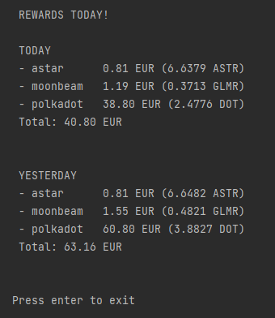

# REWARDS TODAY!

## Introduction
* Are you tired of manually checking how much you made today in staking rewards? 
* Would you like track your rewards without connecting your wallets to any dubious site?
* Does this sound like an infomercial? 

This amazing little program will aggregate and show you an aggregation of your hard-earned staking rewards!

## Output example

## How to use it
1. Install the requirements: `$ pip install -r requirements.txt`
2. Add your addresses (chain + public address) and currency reference to `data.py`
3. Run `main.py`
   
That's it!

Do you want an executable? `$ pyinstaller --onefile -n rewards main.py` \
Find it in the `dist/rewards.exe` directory!

## Supported chains
- All substrate networks
  - Acala
  - Astar
  - Kusama
  - Moonbeam
  - Polkadot
  - Others too! (they just need to be configured in `substrate/substrate_assets.py`)  
- Cardano
- Need more chains? Let me know or DIY and send a pull request :)

## APIs used
- [Subscan API](https://docs.api.subscan.io/) (for substrate networks)
- [Blockfrost](https://blockfrost.io/) (for cardano)
- [CryptoCompare](https://min-api.cryptocompare.com/) (for prices)  
- [py-subscan](https://github.com/joepetrowski/py-subscan) (used as reference)

